# 📱 Pemrograman Mobile – Expense Manager

**Nama:** Keysha Arindra Fabian  
**NIM:** 2341760193 
**Kelas:** SIB-3E 

---

## 📖 Deskripsi Project

Aplikasi **Expense Manager** berbasis Flutter untuk membantu pengguna mencatat pemasukan, pengeluaran, dan memantau statistik keuangan pribadi. Cocok untuk latihan Flutter dan manajemen data sederhana.  
(note: pemasukan masih dalam pengembangan)

---

## ✨ Fitur Utama

| Fitur | Screenshot | Deskripsi |
|-------|------------|-----------|
| **Login** | 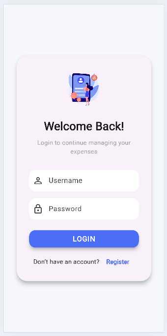 | Menampilkan form login. |
| **Register** | 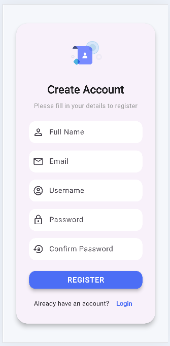 | Menampilkan form register. |
| **Home** | 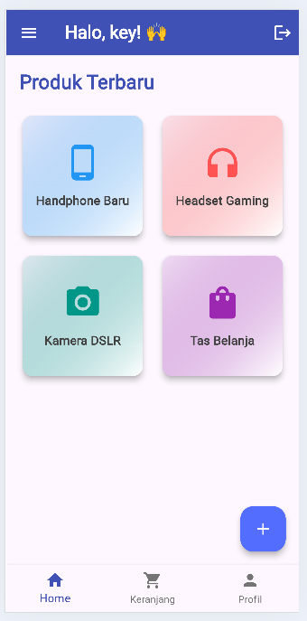 | Menampilkan halaman utama. |
| **Sidebar** | 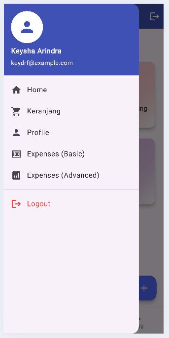 | Menampilkan menu sidebar. |
| **Daftar Transaksi** | 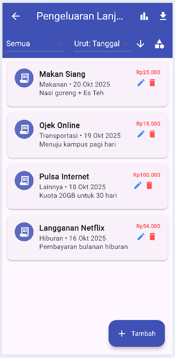 | Menampilkan semua transaksi yang telah dicatat. |
| **Tambah Pengeluaran** | 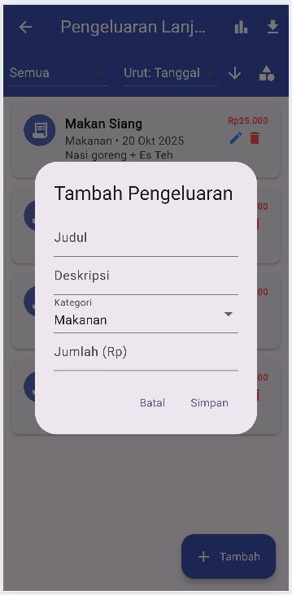 | Menambahkan catatan baru untuk pengeluaran. Input: nama transaksi, jumlah, kategori. |
| **Edit Pengeluaran** | 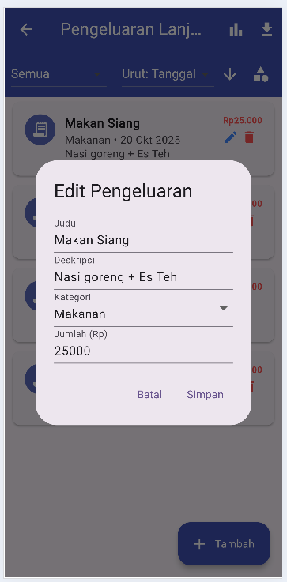 | Mengubah transaksi yang dipilih. Input: nama transaksi, jumlah, kategori. |
| **Filter Transaksi** | 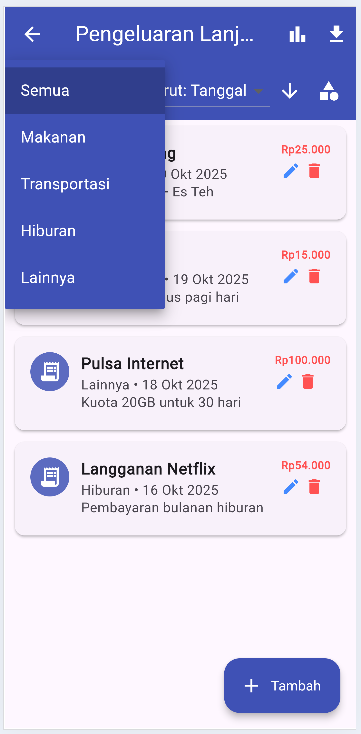 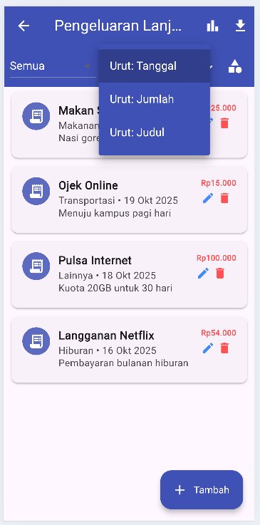 | Memfilter transaksi berdasarkan kategori atau rentang tanggal. Memudahkan analisis per periode tertentu. |
| **Tambah Kategori** | 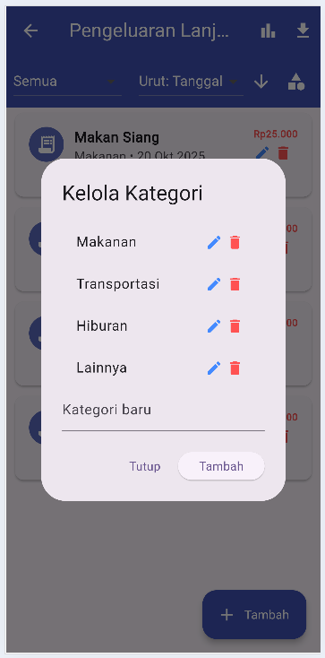 | Menambahkan kategori baru. Input: nama kategori. |
| **Edit Kategori** | 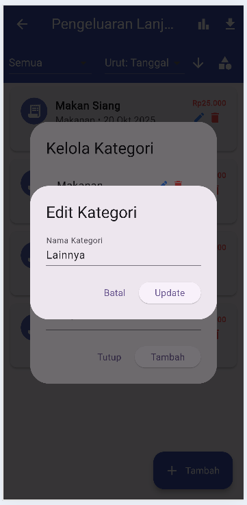 | Mengubah kategori yang dipilih. Input: nama kategori. |
| **Statistik** | 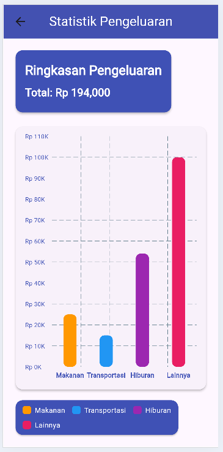 | Menampilkan grafik bar proporsi pengeluaran per kategori. Membantu memahami pola pengeluaran. |
| **Ekspor Data** | 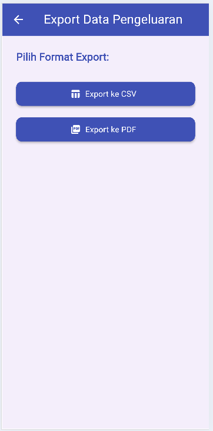 | Menyimpan data transaksi ke file CSV atau PDF. Memudahkan laporan keuangan. |

---

## 🎥 Demo Aplikasi

<video width="320" height="240" controls>
    <source src="vid/demoflutter.mp4" type="video/mp4">
</video>  

---

## 🚀 Getting Started

Project ini adalah titik awal Flutter. Jika ini proyek Flutter pertamamu:  

- [Lab: Write your first Flutter app](https://docs.flutter.dev/get-started/codelab)  
- [Cookbook: Useful Flutter samples](https://docs.flutter.dev/cookbook)  
- [Dokumentasi Flutter](https://docs.flutter.dev/) – tutorial, contoh, panduan, dan referensi API lengkap.  

---

